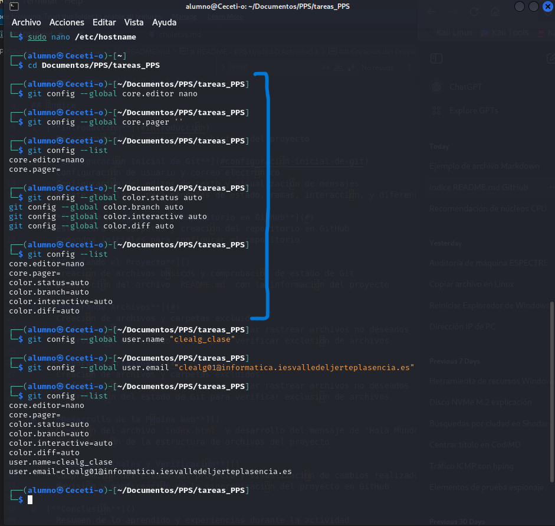
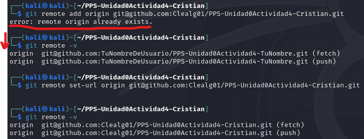
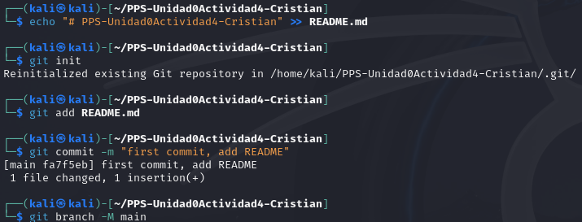
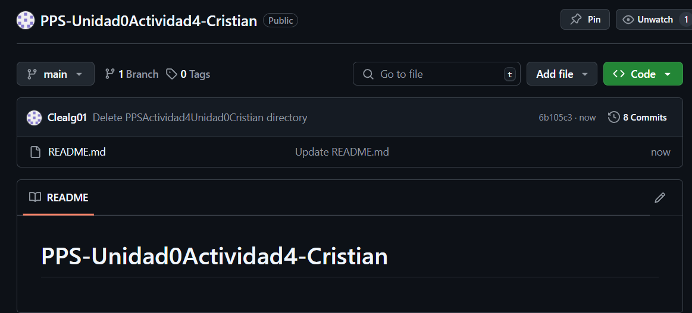

# README - PPS Unidad 0 Actividad 3

## Índice

1. [**Introducción**](#introducción)
   - Descripción de la actividad y objetivo del proyecto

2. [**Configuración Inicial de Git**](#configuración-inicial-de-git)
   - Configuración de usuario y correo electrónico
   - Configuración del editor de texto y visualización de mensajes
   - Ajuste de colores para mensajes de estado, ramas, interacción, y diferencias
  
3. [**Creación del Proyecto y Repositorio en GitHub**](#)
   - Estructura de carpetas y creación del repositorio en GitHub
   - Comandos iniciales para configurar el repositorio

4. [**Iniciando el Proyecto**]()
   - Creación de archivos básicos y comprobación de estado de Git
   - Descripción del archivo `README.md` con la información del proyecto

5. [**Ignorando Archivos**](#)
   - Creación de archivos y carpetas excluidos
   - Configuración de `.gitignore` para evitar rastrear archivos no deseados
   - Comprobación del estado de Git para verificar exclusión de archivos

5. [**Ignorando Archivos**](#)
   - Creación de archivos y carpetas excluidos
   - Configuración de `.gitignore` para evitar rastrear archivos no deseados
   - Comprobación del estado de Git para verificar exclusión de archivos

6. [**Desarrollo de la Página Web**]()
   - Creación del archivo `index.html` y desarrollo del mensaje de "Hola Mundo"
   - Visualización de la estructura de archivos del proyecto

7. [**Comandos Finales y Verificación**]()
   - Comprobación del estado del proyecto y visualización de cambios realizados
   - Revisión y confirmación de la sincronización del proyecto en GitHub

8. [**Conclusión**]()
   - Resumen de lo aprendido y experiencias durante la actividad

---
1. **Introducción**
   - Descripción de la actividad y objetivo del proyecto

2. **Configuración Inicial de Git**
   - Configuración de usuario y correo electrónico
   - Configuración del editor de texto y visualización de mensajes
   - Ajuste de colores para mensajes de estado, ramas, interacción, y diferencias

3. **Creación del Proyecto y Repositorio en GitHub**
   - Estructura de carpetas y creación del repositorio en GitHub
   - Comandos iniciales para configurar el repositorio

4. **Iniciando el Proyecto**
   - Creación de archivos básicos y comprobación de estado de Git
   - Descripción del archivo `README.md` con la información del proyecto

5. **Ignorando Archivos**
   - Creación de archivos y carpetas excluidos
   - Configuración de `.gitignore` para evitar rastrear archivos no deseados
   - Comprobación del estado de Git para verificar exclusión de archivos

6. **Desarrollo de la Página Web**
   - Creación del archivo `index.html` y desarrollo del mensaje de "Hola Mundo"
   - Visualización de la estructura de archivos del proyecto

7. **Comandos Finales y Verificación**
   - Comprobación del estado del proyecto y visualización de cambios realizados
   - Revisión y confirmación de la sincronización del proyecto en GitHub

8. **Conclusión**
   - Resumen de lo aprendido y experiencias durante la actividad

---

## Introducción
En esta actividad, aprenderemos los conceptos básicos de control de versiones con Git y la gestión de repositorios en GitHub. La actividad se centra en configurar Git en nuestro entorno de trabajo, crear un repositorio en GitHub y realizar operaciones esenciales de seguimiento de cambios en un proyecto de desarrollo web. A través de una serie de pasos guiados, abordaremos la configuración de usuario, personalización de Git, manejo de archivos con `.gitignore`, y los comandos fundamentales para crear, modificar y sincronizar proyectos en un repositorio remoto.

El objetivo principal es familiarizarnos con el flujo de trabajo de Git para que podamos gestionar eficazmente el historial de versiones en futuros proyectos y colaborar en equipo de manera eficiente. Como práctica, desarrollaremos una simple página web con un mensaje de "Hola Mundo" que nos servirá para explorar cómo Git rastrea cambios y permite un control detallado del código fuente.

## Configuración Inicial de Git

En esta sección configuraremos algunas opciones adicionales en Git para mejorar la experiencia de usuario. Esto incluye definir el editor predeterminado, personalizar la visualización de mensajes, y ajustar los colores para facilitar la lectura de los cambios.

*1*. **Configuración del Editor de Comandos**

Primero, vamos a configurar el editor de texto que usaremos en Git. Para simplificar, utilizaremos `nano` como editor predeterminado. Ejecuta el siguiente comando en tu terminal:
   ```bash
   git config --global core.editor nano
   ```
> **Nota**: La opción `--global` indica que esta configuración se aplicará a nivel global para todos los repositorios Git del usuario en el sistema.

*2*. **Configuración del Visor de Mensajes para `git diff` y `git log`**

Para que los comandos `git diff` y `git log` muestren los mensajes completos directamente en la terminal sin abrir un editor, establece la configuración de `core.pager` como vacía:

   ```bash
   git config --global core.pager ''
   ```
Esto hará que Git muestre toda la salida de estos comandos sin utilizar un paginador, permitiendo una visualización continua en la terminal.
*3*. **Consulta de las Variables de Configuración de Git**

Para ver las opciones de configuración disponibles en Git, puedes utilizar el siguiente comando de ayuda:
   ```bash
git config --help
   ```
Este comando te mostrará una lista de configuraciones que puedes ajustar según tus necesidades. También puedes usar `git config --list` para ver las configuraciones actuales.

*4*. **Configuración de Colores en Git**

Para mejorar la visualización de ciertos comandos en la terminal, vamos a activar los colores automáticos en Git para que resalten los estados, ramas, interacción y diferencias. Ejecuta los siguientes comandos:
   ```bash
git config --global color.status auto
git config --global color.branch auto
git config --global color.interactive auto
git config --global color.diff auto
   ```
Estos comandos ajustan los colores de manera que Git aplique automáticamente el color adecuado al mostrar el estado del repositorio, las ramas, las interacciones y las diferencias entre archivos.

<p align="center">
  
</p>
<p align="center"><em>Imagen 1: Configuración Inicial de Git</em></p>

## Creación del Proyecto y Repositorio en GitHub
En este paso, vamos a crear una nueva carpeta en nuestro sistema, inicializar un repositorio de Git en ella, y enlazarlo con un repositorio remoto en GitHub.

*1*. **Crear la Carpeta del Proyecto**

En tu directorio principal de proyectos de Git, crea una nueva carpeta para esta actividad. Puedes nombrarla como se indica a continuación, reemplazando TuNombre con tu propio nombre.
   ```bash
mkdir PPS-Unidad0Actividad4-TuNombre
cd PPS-Unidad0Actividad4-TuNombre
   ```
*2*. **Crear un Repositorio Público en GitHub**

- Accede a GitHub y crea un nuevo repositorio público llamado ``PPS-Unidad0Actividad4-TuNombre``.
- No añadas ningún archivo como README o .gitignore desde la interfaz de GitHub, ya que los crearemos localmente.

*3*. **Configuración del Repositorio en Línea de Comandos**

Ahora, sigue los comandos a continuación para inicializar el repositorio, agregar un archivo README y vincular el repositorio local con el remoto en GitHub.

   ```bash
# Crea un archivo README.md con el nombre del proyecto
echo "# PPS-Unidad0Actividad4-TuNombre" >> README.md

# Inicializa un repositorio de Git en la carpeta actual
git init

# Agrega el archivo README.md al área de preparación
git add README.md

# Realiza el primer commit con un mensaje descriptivo
git commit -m "first commit"

# Cambia la rama principal a 'main'
git branch -M main

# Agrega el repositorio remoto (reemplaza "TuNombreDeUsuario" por tu nombre de usuario en GitHub)
git remote add origin git@github.com:TuNombreDeUsuario/PPS-Unidad0Actividad4-TuNombre.git

# Envía los cambios a la rama principal del repositorio remoto
git push -u origin main
   ```

> Nota: Si ya tienes un ``origin`` configurado, es decir, un repositorio remoto configurado y deseas hacer cambios en otro repositorio al poner un origen distinto al configurado se genera un error `remote origin already exists`. Esto ocurre porque el comando git remote add origin intenta agregar un nuevo origen, pero el nombre origin ya está en uso. Para solucionarlo, primero verifica las url que estén configuradas y, luego, actualizalas. 
> - **Verifica el origen remoto actual**:
>    ```bash
>   git remote -v
>   ```
> - **Actualiza el origen remoto**:
>    ```bash
>   git remote set-url origin git@github.com:Clealg01/PPS-Unidad0Actividad4-Cristian.git
>   ```
> - **Elimina el origen y vuelve a agregarlo**:
>    ```bash
>    git remote remove origin
>    git remote add origin git@github.com:Clealg01/PPS-Unidad0Actividad4-Cristian.git
>    ```
> - **Verifica el origen remoto actual**: <p align="center">
  
</p>

> <p align="center"><em>Imagen 2: Solución cambiar repositorio remoto</em></p>
 
*4*. **Confirmación en GitHub**

Después de ejecutar estos comandos, tu proyecto debería estar disponible en GitHub en el repositorio ``PPS-Unidad0Actividad4-TuNombre``. Puedes verificarlo visitando el enlace de tu repositorio en GitHub.

> Nota: Asegúrate de reemplazar ``TuNombreDeUsuario`` y ``TuNombre`` en los comandos y el nombre de la carpeta según corresponda a tu caso.

<div style="display: flex; justify-content: center; gap: 20px;">

<div style="text-align: center;">
    
    <div style="font-style: italic; margin-top: 8px;">Imagen 3: Inicializar repositorio</div>
</div>

<div style="text-align: center;">
    
    <div style="font-style: italic; margin-top: 8px;">Imagen 4: Subir arhcivo README.md a repositorio remoto</div>
</div>

</div>

<p align="center">
  
</p>
<p align="center"><em>Imagen 5: Repositorio inicializado</em></p>

## askdlfjals

